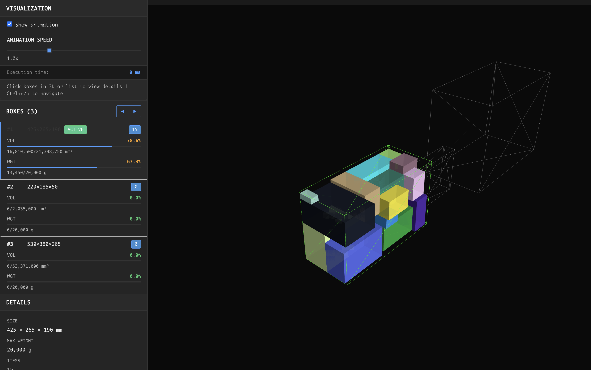

# boxpacker3-ui



Visual debugger for [boxpacker3](https://github.com/bavix/boxpacker3) - interactive web interface to visualize and test box packing algorithms.

## Installation

```sh
go install github.com/bavix/boxpacker3-ui@latest
```

## Usage

Start the service (default port `8080`):
```sh
boxpacker3-ui
```

Custom port:
```sh
PORT=4000 boxpacker3-ui
```

Open `http://localhost:8080` in your browser.

## UI Overview

The interface consists of:

- **Left Panel**: Settings and controls
  - **Import/Export buttons**: Load or save CSV files
  - **Input field**: Add boxes/items manually (format: `width;height;depth;weight`)
  - **Tabs**: Switch between Boxes and Items
  - **Checkboxes**: Enable/disable boxes or items for packing
  - **Strategy selector**: Choose packing algorithm
  - **2D Mode checkbox**: Switch to top-down view
  - **Animation controls**: Toggle animation and adjust speed
  - **Box list**: View packed boxes with statistics (volume/weight utilization)
  - **Details panel**: Detailed information about selected box

- **Right Panel**: 3D/2D visualization
  - Interactive 3D view with camera controls
  - Click boxes to select and view details
  - Navigate between boxes with `Ctrl+←/→` or arrow buttons

## Features

- 3D and 2D visualization
- Multiple packing strategies
- CSV import/export
- Animation and statistics

## CSV Format

```
width;height;depth;weight;type
```

- `type`: `0` = box, `1` = item (optional, defaults to `1`)
- For 2D mode: use `depth=1`

Example:
```
500;400;1;20000;0  # Box: 500×400
100;80;1;500;1    # Item: 100×80
```

## Keyboard Shortcuts

- `Ctrl+←` / `Ctrl+→` (or `Cmd+←` / `Cmd+→` on Mac) - Navigate between boxes
- `W` / `↑` - Move camera forward (3D mode)
- `S` / `↓` - Move camera backward (3D mode)
- `A` / `←` - Move camera left (3D mode)
- `D` / `→` - Move camera right (3D mode)
- `Mouse drag` - Rotate camera (3D mode)
- `Mouse wheel` - Zoom in/out

## Examples

Sample CSV files can be found in the [`examples/`](examples/) directory.

## Development Debugging

To debug boxpacker3 library locally:

1. Add `replace` directive in `go.mod`:
```go
module github.com/bavix/boxpacker3-ui

go 1.25

require github.com/bavix/boxpacker3 v1.2.0

replace github.com/bavix/boxpacker3 => /path/to/local/boxpacker3
```

2. Update version if needed:
```sh
go mod edit -require=github.com/bavix/boxpacker3@v1.2.0
go mod tidy
```

3. Run the debugger:
```sh
go run main.go
```

Example with local boxpacker3 at `../boxpacker3`:
```go
replace github.com/bavix/boxpacker3 => ../boxpacker3
```
